# Assignment 1: Tabular Reinforcement Learning

**Authors:** Igor Ruiz, Andoni Garrido

Reinforcement Learning, Universidad de Deusto. **SARSA and Q-learning** on the class 3x4 gridworld, deterministic and stochastic (the minimum requirement). It also covers:
- a comparison of **6 tabular algorithms**;
- a second environment (**Cliff Walking**);
- **Optuna** hyper-parameter tuning;
- a deeper **analysis of the training process**.

All results are **cached**: the plots and tables are regenerated in a few seconds without training.

---

## Setup

Python ≥ 3.11.

```bash
# with uv
uv venv && uv pip install -r requirements.txt
# or with pip
python -m venv .venv && source .venv/bin/activate && pip install -r requirements.txt
```

Libraries beyond the ones used in class: `optuna` (tuning), `pandas` (tables), `python-pptx` (slides), `pytest` (tests).

## How to run

| Command | What it does |
|---|---|
| `python -m experiments.run_all` | Rebuilds every figure and table **from the cache** (~10 s, no training) |
| `python -m experiments.run_all --retrain` | Trains everything again from scratch (~13 min on 8 cores) |
| `python -m experiments.run_all --only exp1 exp3` | Runs only some experiments |
| `python -m experiments.demo` | Loads a **saved model** (Q-table) and plays it in the class pygame `GridworldEnv` |
| `python -m experiments.demo --env gridworld_slippery --algo SARSA --render ansi --episodes 3` | Same, in the terminal |
| `python docs/make_slides.py` | Builds `docs/presentation.pptx` from the figures |
| `pytest -q` | Runs the tests (DP ground truth, policy iteration = value iteration, env equivalence, convergence, Expected SARSA = Q-learning at ε=0, cache) |

## Repository layout

```
class_code/          env.py + tools.py from class (GridworldEnv)
tabular_rl/
  envs.py            EnvSpec (the env.P format from class), gridworld + Cliff Walking, fast Simulator
  agents.py          Monte Carlo (1/N, constant α, exploring starts), SARSA, n-step SARSA, Expected SARSA,
                     Q-learning, Double Q-learning; optional Robbins–Monro step size α/(1+k·N(s,a))
  dp.py              value iteration (ground truth Q*), policy iteration, exact policy evaluation (for metrics)
  runner.py          multi-seed training, metrics, disk cache, model save/load
  viz.py             plot style and helpers
experiments/         exp1 ... exp6, run_all.py, demo.py
results/
  cache/             cached training results (.npz + .json with the config and training time)
  models/            final Q-tables per environment x algorithm (.npy)
  figures/           all plots
  tables/            all tables (.csv)
docs/                THEORY.md (Q&A for the oral part), presentation.pptx, make_slides.py
tests/
```

## Method

- **Environments**:
  - **Gridworld 3x4** from class (`class_code/env.py`): +1 goal, −1 pit, one wall. Deterministic or slippery (80% intended move, 10% each perpendicular).
  - **Cliff Walking 4x12** (Sutton & Barto): −1 per step; −100 and back to the start on the cliff.
  - Both are written in the same `P[s][a] = [(prob, s', r, done)]` format.
- **Model-free agents**: they only use `reset()` / `step()`. The model `P` is used **only** by value iteration, to get the ground truth Q\*, and by exact policy evaluation, for the metrics.
- **Exploration**: ε-greedy with random tie-breaking and exponential decay ε_k = max(ε_min, ε_0·decay^k). γ = 0.99.
- **Statistics**: every configuration is run with **20 seeds**. The plots show median + IQR for noisy curves, or mean ± std.
- **Metrics**:
  - **training return**, which includes exploration;
  - **regret of the greedy policy**, V\*(s0) − V^π(s0), computed exactly;
  - **RMSE of Q on the optimal actions**, compared with Q\*;
  - **% of states with an optimal greedy action**.

Default hyper-parameters:

| Environment | Episodes | α | ε (start, min, decay) |
|---|---|---|---|
| Gridworld deterministic | 3000 | 0.1 | (1.0, 0.05, 0.995) |
| Gridworld slippery | 10000 | 0.1 | (1.0, 0.05, 0.9995) |
| Cliff Walking | 1000 | 0.5 | (0.1, 0.1, 1.0), i.e. constant 0.1 |
| Gridworld slippery, convergent schedule (exp1 only) | 30000 | 0.5 / (1 + 0.005·N(s,a)) | (1.0, 0.0, 0.9998) |

---

## Results

### 1. Minimum requirement: SARSA and Q-learning (`exp1`)

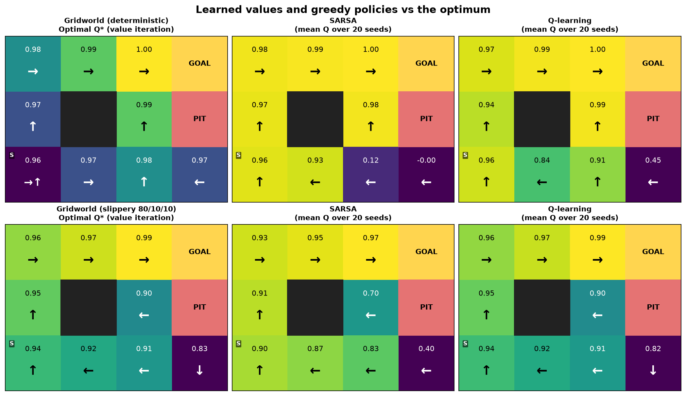
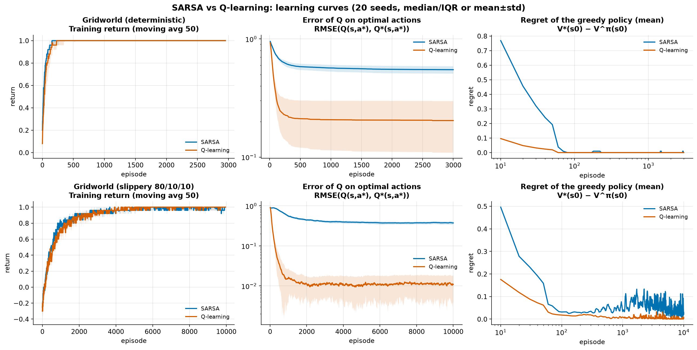

| Environment | Algorithm | Return (last 100 ep) | RMSE Q (optimal a) | Optimal actions % | Regret at s0 | Seeds with π\* |
|---|---|---|---|---|---|---|
| Deterministic | SARSA | 0.999 | 0.549 | 81.1 | 0.0000 | 20/20 |
| Deterministic | Q-learning | 0.993 | 0.204 | 94.4 | 0.0000 | 20/20 |
| Slippery | SARSA | 0.979 | 0.374 | 85.0 | 0.0512 | 15/20 |
| Slippery | Q-learning | 0.987 | **0.011** | **97.8** | **0.0039** | **19/20** |
| Slippery, convergent schedule | SARSA | 0.999 | 0.244 | 88.9 | **0.0000** | **20/20** |
| Slippery, convergent schedule | Q-learning | 1.000 | **0.008** | **99.4** | **0.0000** | **20/20** |

**Deterministic.** Both algorithms find the optimal path (up, up, right, right, right) in every seed.

**Slippery.** The optimal policy changes:
- in state 6, go LEFT, away from the pit;
- in state 11, push DOWN into the wall, so a slip can never take the agent into the pit.

Q-learning recovers Q\* almost exactly. SARSA learns the value of its own ε-greedy policy, so its values next to the pit are lower. That is the expected on-policy behaviour (Bellman equation vs BOE), not an error.

**Why SARSA misses π\* in 5 seeds with the default schedule, and the fix.** With ε_min = 0.05 and a constant α:
- SARSA learns Q of the ε-greedy policy, not Q\*;
- the states next to the pit (6 and 11) are rarely visited, so their Q values stay noisy and the greedy action there can be wrong.

The theory gives two conditions for SARSA to converge to the optimum:
- **GLIE** exploration: every pair (s,a) visited infinitely often and ε → 0;
- a **Robbins-Monro** step size: Σα = ∞, Σα² < ∞.

The "convergent schedule" meets both:
- ε decays to 0 (ε_0 = 1, decay = 0.9998);
- α(s,a) = 0.5 / (1 + 0.005·N(s,a)), where N(s,a) is the visit count (`agents.step_size`);
- 30 000 episodes.

With it, **both algorithms reach the optimal policy in 20/20 seeds**. SARSA still needs about 15× more episodes than Q-learning to settle (median 13 510 vs 900), which is the cost of learning on-policy.

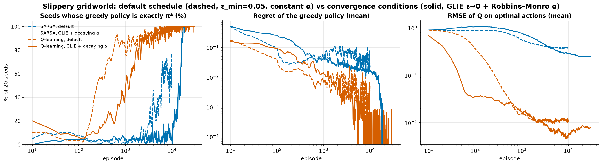

The figure also shows the price of these guarantees. Q-learning with the default schedule reaches π\* in most seeds within about 500 episodes, sooner than with the convergent schedule. The default schedule just never gets *all* seeds there, because ε_min = 0.05 and a constant α keep it noisy. Theory guarantees the limit, not the speed.

RMSE over *all* actions stays high in the deterministic world. Once the agent has found the path, it rarely visits bad actions or far states again (`exp5d`). That is why we report the error on the optimal actions.

### 2. All tabular algorithms (`exp2`)

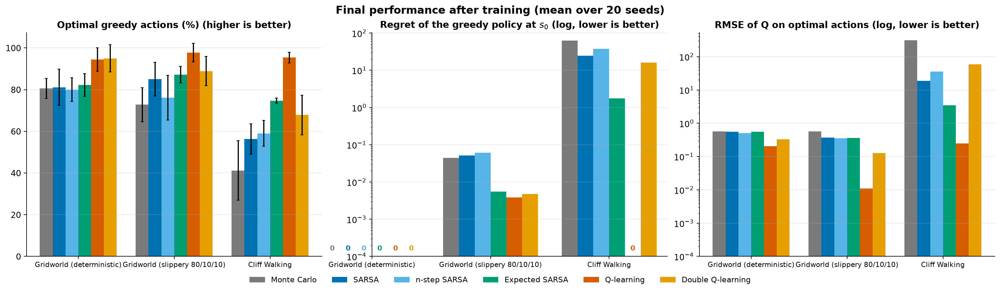

Per-environment curves and policies are in `results/figures/exp2_curves_*.png` and `exp2_policies_*.png`. The full table is in `results/tables/exp2_all_algorithms.csv`.

- **Q-learning** gives the most accurate Q\* and the lowest regret in all 3 environments.
- **Expected SARSA** is the best on-policy method: it has lower variance than SARSA and the best online return in Cliff Walking (−19.9).
- **Double Q-learning** removes maximisation bias, but each table gets half the updates, so it is slower. In Cliff Walking it is unstable in a few seeds: the median return is −25 but the mean is −221.
- **n-step SARSA (n=3)** propagates the sparse reward faster, but the multi-step returns are noisier under slippery transitions.
- **Monte Carlo** works in the gridworld but **fails in Cliff Walking** (return ≈ −374). With a bad initial policy, episodes hit the 500-step limit, so there is no informative return. "MC needs finished episodes" is exactly the limitation from the slides.

### 3. On-policy vs off-policy: Cliff Walking (`exp3`)

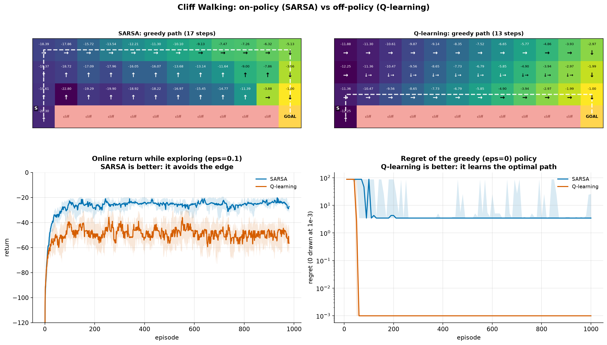

| Algorithm | Greedy path | Online return (ε=0.1) | Greedy policy optimal |
|---|---|---|---|
| SARSA | 17 steps (safe, away from the edge) | **−25.8** | 0/20 seeds |
| Q-learning | 13 steps (along the cliff edge) | −51.9 | **20/20 seeds** |

This is the classic result. Q-learning learns the optimal path but keeps falling off while exploring. SARSA includes its own exploration in its target, so it prefers the safe path.

### 4. Hyper-parameter tuning with Optuna (`exp4`)

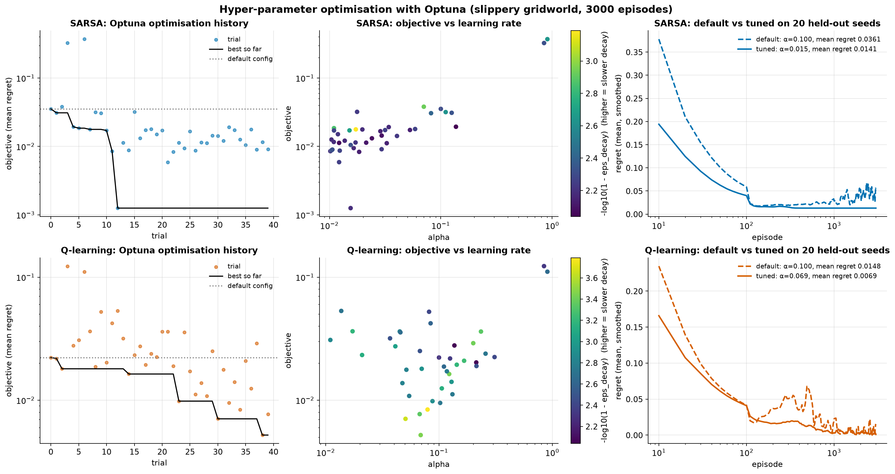

**Setup.** TPE sampler, 40 trials per algorithm. The search space is α ∈ [0.01, 1] and the full ε schedule. The objective is the mean regret over training (speed of learning) on 5 tuning seeds. The comparison uses **20 held-out seeds**.

| Algorithm | Config | α | ε (start, min, decay) | Mean regret (held-out) | Seeds with π\* |
|---|---|---|---|---|---|
| SARSA | default | 0.1 | (1.0, 0.05, 0.995) | 0.0361 | 7/20 |
| SARSA | tuned | 0.0155 | (0.52, 0.0016, 0.9936) | **0.0141** | 5/20 |
| Q-learning | default | 0.1 | (1.0, 0.05, 0.995) | 0.0148 | 7/20 |
| Q-learning | tuned | 0.0689 | (0.93, 0.0027, 0.9996) | **0.0069** | **19/20** |

**Findings:**
- Tuning more than halves the regret for both algorithms.
- The main gain is a much lower ε_min: less random behaviour at the end.
- SARSA prefers a small α. Its target is noisier because it depends on the sampled a'.
- **Lower regret does not mean more seeds with π\* (SARSA: 7/20 → 5/20).** The objective is the mean regret *over training*, which rewards fast learning. The tuned SARSA:
  - with α = 0.0155, gets close to π\* quickly but makes small updates;
  - therefore, in the states next to the pit, it often stays on an almost-tied, slightly worse action.

  The regret is small but not 0. The objective decides what "better" means; tuning on "seeds with π\*" would trade speed for exactness.
- The gap between the tuning objective (0.0013) and the held-out result (0.0141) shows **over-fitting to the tuning seeds**, which is why we evaluate on separate seeds.

### 5. Analysis of the training process (`exp5`)

| | |
|---|---|
| 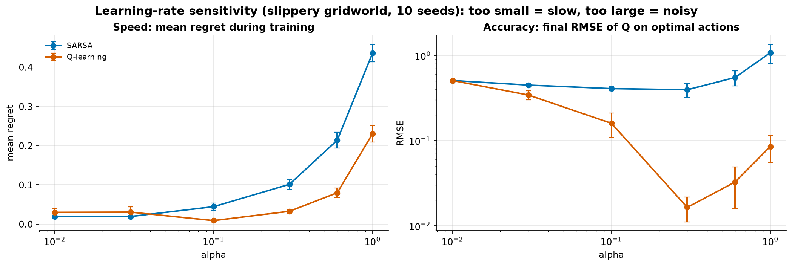 | 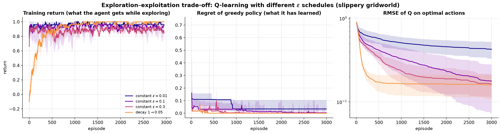 |
| 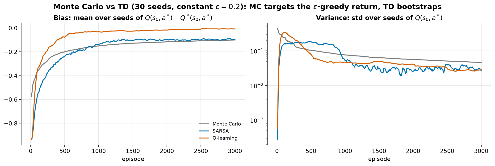 | 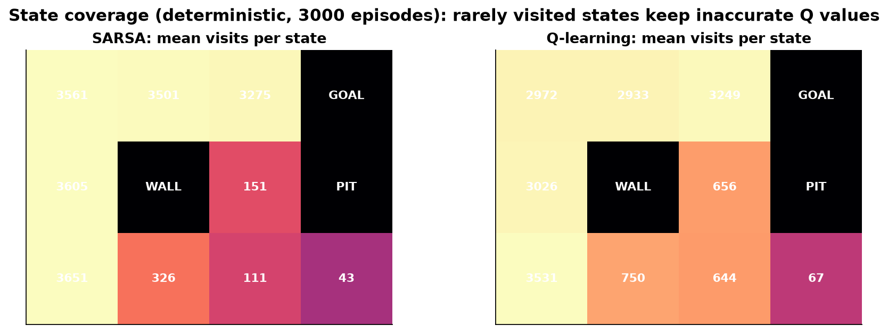 |

- **Learning rate.** In the stochastic world, a large α (≥ 0.6) makes Q chase single noisy samples: high regret and high error. A very small α (0.01) has not converged after 3000 episodes. Q-learning is most accurate around α = 0.1–0.3; SARSA prefers smaller α, because its target is noisier.
- **Exploration.** A small constant ε gives a high training return but learns Q poorly, while a large ε explores but behaves worse. Decaying ε gets both.
- **MC vs TD.**
  - MC converges to Q of the ε-greedy policy (unbiased for that policy) but its spread across seeds decreases slowly (high variance).
  - Q-learning bootstraps towards Q\* (bias → 0).
- **Coverage.** States off the optimal path are visited orders of magnitude less often, so their Q values stay inaccurate.

---

### 6. Failure analysis: why some methods fail in Cliff Walking (`exp6`)

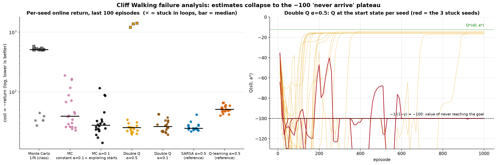

Cliff Walking pays −1 per step, so with γ = 0.99 a policy that **never reaches the goal is worth −1/(1−γ) = −100**. The first episodes are very long: hundreds of steps and many falls. If the estimates collapse to that −100 plateau before the goal is found, the following happens:
- every action looks equally bad;
- the greedy policy loops;
- the goal signal never propagates back.

| Variant | Stuck seeds | Median return (last 100 ep) | Greedy regret (median) |
|---|---|---|---|
| Monte Carlo, step 1/N (class version) | **14/20** | −507.9 | 87.75 |
| MC, constant α = 0.1 | 0/20 | −39.0 | 5.14 |
| MC, constant α = 0.1 + exploring starts | 0/20 | −27.5\* | 3.46 |
| Double Q-learning, α = 0.5 | **3/20** | −25.1 (mean −221) | 3.46 |
| Double Q-learning, α = 0.1 | 0/20 | −26.1 | 3.46 |
| SARSA, α = 0.5 (reference) | 0/20 | −24.4 | 3.46 |
| Q-learning, α = 0.5 (reference) | 0/20 | −50.7 | **0.00** |

\* With exploring starts the episodes begin at random states, so the return is not directly comparable.

**Monte Carlo.** With the class step size 1/N(s,a), Q is the mean of *all* returns ever seen. The catastrophic returns of the first, random episodes (about −1500) stay in that mean forever. In control the policy keeps improving, so the target is **non-stationary**. A constant α forgets old returns and fixes the collapse. Exploring starts (class *Monte-Carlo ES*) helps further: every (s,a) keeps being tried from short episodes near the goal.

**Double Q-learning.** Each table gets only half of the updates. With a large α (0.5), in 3 seeds the Q values at the start state fall to −100 (red curves) and never recover. With α = 0.1, 0/20 seeds get stuck.

A greedy regret of 3.46 is the safe path (17 steps instead of 13). Every on-policy method converges to it, because its target includes the ε = 0.1 exploration (see `exp3`).

## Conclusions

1. SARSA and Q-learning both solve the deterministic and the stochastic gridworld.
2. Q-learning (BOE) converges to Q\*. SARSA (Bellman equation) converges to the value of the ε-greedy policy, which makes it **safer while exploring** (Cliff Walking).
3. Stochastic transitions need a decaying α and ε → 0 (Robbins–Monro + GLIE) for SARSA and Q-learning to reach π\* in every seed.
4. TD bootstraps: low variance, biased. MC uses real returns: unbiased, high variance, and episodes must terminate.
5. Expected SARSA reduces variance. Double Q-learning removes maximisation bias but learns more slowly.
6. Hyper-parameters matter. Optuna more than halved the regret, but tuning must be validated on held-out seeds.
7. The failures in Cliff Walking are explained by theory. Monte Carlo's 1/N mean cannot forget the first catastrophic returns (the target is non-stationary in control), and too large an α makes Double Q collapse to the −100 "never arrive" plateau. Constant-α MC, exploring starts and a smaller α fix both.

Theory Q&A for the oral part: [`docs/THEORY.md`](docs/THEORY.md). Slides: [`docs/presentation.pptx`](docs/presentation.pptx).
