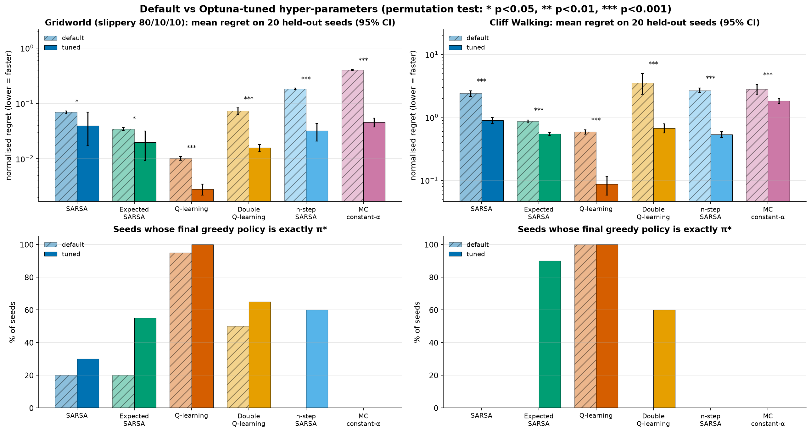

# Assignment 1 · Aprendizaje por refuerzo tabular

**Igor Ruiz · Andoni Garrido** — Reinforcement Learning, Universidad de Deusto

Este repositorio es nuestra entrega del assignment de RL tabular. El mínimo que se pedía era implementar **SARSA y Q-learning** sobre el gridworld de clase, tanto en su versión determinista como en la estocástica. A partir de ahí quisimos entender bien *por qué* se comportan distinto y *qué hace falta* para que converjan, así que fuimos añadiendo cosas:

- comparamos **seis algoritmos tabulares**: Monte Carlo, SARSA, n-step SARSA, Expected SARSA, Q-learning y Double Q-learning;
- añadimos un segundo entorno, **Cliff Walking**, que es donde mejor se ve la diferencia entre on-policy y off-policy;
- ajustamos los hiperparámetros con **Optuna** (12 estudios, 150 pruebas cada uno);
- analizamos el propio entrenamiento: tasa de aprendizaje, exploración, sesgo/varianza de MC frente a TD y por qué algunos métodos se atascan.

La presentación de 5 minutos está en [`presentation.html`](presentation.html). Se abre en el navegador; con las flechas se avanza, con `N` se ven las notas y con `F` se pone a pantalla completa.

---

## Cómo ponerlo en marcha

Usamos [uv](https://docs.astral.sh/uv/) para gestionar el entorno. Las dependencias están en `pyproject.toml` y las versiones exactas en `uv.lock`, así que basta con:

```bash
curl -LsSf https://astral.sh/uv/install.sh | sh   # instalar uv (solo la primera vez)
uv sync                                           # crea .venv con las versiones exactas
```

Además de lo visto en clase solo usamos `optuna` (para el tuning) y `pandas` (para las tablas).

## Comandos

| Comando | Qué hace |
|---|---|
| `uv run python -m experiments.run_all` | Entrena todo y vuelve a generar todas las figuras y tablas de `results/`. La primera vez tarda unos 6–20 min según el ordenador; guarda una caché local, así que las siguientes tardan segundos |
| `uv run python -m experiments.run_all --only exp1 exp3` | Lo mismo, pero solo con los experimentos indicados |
| `uv run python -m experiments.demo` | Carga un modelo ya entrenado y lo juega en la ventana de pygame del gridworld de clase. No entrena nada |
| `uv run python -m experiments.demo --env gridworld_slippery --algo SARSA --render ansi --episodes 3` | La demo en la terminal, con otro entorno y otro algoritmo |
| `uv run python -m experiments.tune` | La búsqueda de hiperparámetros con Optuna (~1 h de CPU). Si se corta, al relanzarla sigue donde iba. Con `--quick` se comprueba en segundos que funciona |

El entrenamiento usa semillas fijas, así que cada ejecución da **exactamente los mismos números** que hay en este README.

## Estructura del repositorio

| Archivo | Qué hace |
|---|---|
| **`tabular_rl/`** | **La librería** |
| `class_gridworld.py` | El `GridworldEnv` de clase, tal cual nos lo dieron |
| `envs.py` | Los 3 entornos (grid normal, grid resbaladizo y Cliff Walking) en el formato `P` de clase |
| `simulator.py` | Juega un entorno paso a paso. Es lo único que ven los agentes |
| `planning.py` | Value iteration y policy iteration: la solución exacta, que solo usamos para evaluar |
| `agents/base.py` | Lo común a todos: ε-greedy, el calendario de ε y el tamaño de paso α |
| `agents/monte_carlo.py` | Monte Carlo (media 1/N, α constante, exploring starts) |
| `agents/sarsa.py` | SARSA, Expected SARSA y n-step SARSA (on-policy) |
| `agents/q_learning.py` | Q-learning y Double Q-learning (off-policy) |
| `metrics.py` | Puntúa una tabla Q contra la Q* exacta (regret, error, % de acciones óptimas) |
| `training.py` | Entrena un algoritmo con 20 semillas en paralelo, con caché local |
| `models.py` | Guarda y carga las tablas Q |
| `plotting.py` | Estilo y gráficas comunes |
| `stats.py` | Intervalos de confianza (bootstrap) y test de permutación |
| **`experiments/`** | **Un archivo por pregunta que nos hicimos** |
| `exp1_main.py` | Requisito mínimo: SARSA y Q-learning en el grid de clase |
| `exp2_compare_all.py` | Los 6 algoritmos en los 3 entornos (y guarda los modelos para la demo) |
| `exp3_cliff_walking.py` | On-policy frente a off-policy en el cliff |
| `exp4_optuna.py` | Análisis de Optuna: frentes de Pareto, configuración por defecto frente a la ajustada e importancia de cada hiperparámetro |
| `exp5_training_analysis.py` | Tasa de aprendizaje, exploración, MC frente a TD y estados visitados |
| `exp6_failure_analysis.py` | Por qué Monte Carlo y Double Q se atascan en el cliff, y cómo arreglarlo |
| `tune.py` | La búsqueda de Optuna en sí |
| `run_all.py` | Ejecuta todos los experimentos |
| `demo.py` | Carga un modelo guardado y lo juega, sin entrenar |
| **`results/`** | **Lo que sale de los experimentos** |
| `figures/`, `tables/` | Todas las figuras y tablas de este README y de la presentación |
| `models/` | Las tablas Q finales del gridworld, una por algoritmo (las usa la demo) |
| `optuna/studies.db` | Los 12 estudios de Optuna. Fue una hora de cálculo en otro ordenador, así que lo guardamos |
| **`presentation.html`** | **La presentación de 5 minutos, con diapositivas extra para las preguntas** |

---

## Cómo lo hemos montado

**Los entornos.**
- El **gridworld 3×4 de clase**: +1 en la meta, −1 en el pozo y una pared. Lo usamos en dos versiones: determinista, y resbaladiza (el 80% de las veces te mueves a donde quieres y un 10% a cada lado).
- **Cliff Walking** de Sutton & Barto (4×12): cada paso cuesta −1, y caerse por el acantilado cuesta −100 y te devuelve a la salida.

Los tres están escritos en el mismo formato `P[s][a] = [(prob, s', r, done)]` que usamos en clase.

**Los agentes no conocen el modelo.** Solo llaman a `reset()` y `step()`, igual que con el entorno de clase. Nosotros sí conocemos `P`, y eso nos permite algo muy útil: calcular con value iteration la **solución exacta Q\*** y medir cuánto se aleja cada agente de ella.

**Cómo medimos:**
- **Retorno durante el entrenamiento:** lo que gana el agente mientras explora.
- **Regret de la política greedy:** V\*(s₀) − V^π(s₀), calculado de forma exacta. Un 0 significa que la política aprendida es óptima de verdad.
- **Error de Q en las acciones óptimas:** las que importan para decidir.
- **% de estados** en los que la acción greedy es óptima.

Cada configuración se entrena con **20 semillas**, para hablar de lo que pasa normalmente y no de una ejecución con suerte.

**Exploración:** ε-greedy, rompiendo empates al azar (al principio todos los valores son 0 y si no el agente siempre iría a la izquierda), con un ε que decae: ε_k = max(ε_min, ε₀·decay^k). Usamos γ = 0,99.

Hiperparámetros por defecto:

| Entorno | Episodios | α | ε (inicio, mínimo, decay) |
|---|---|---|---|
| Grid determinista | 3000 | 0,1 | (1,0, 0,05, 0,995) |
| Grid resbaladizo | 10000 | 0,1 | (1,0, 0,05, 0,9995) |
| Cliff Walking | 1000 | 0,5 | ε constante de 0,1 |
| Grid resbaladizo, versión "convergente" (solo exp1) | 30000 | 0,5 / (1 + 0,005·N(s,a)) | (1,0, 0,0, 0,9998) |

---

## Resultados

### 1. Requisito mínimo: SARSA y Q-learning (`exp1`)


| Entorno | Algoritmo | Retorno (últimos 100 ep.) | Error de Q (acción óptima) | % acciones óptimas | Regret en s₀ | Semillas con π\* |
|---|---|---|---|---|---|---|
| Determinista | SARSA | 0,999 | 0,549 | 81,1 | 0,0000 | 20/20 |
| Determinista | Q-learning | 0,993 | 0,204 | 94,4 | 0,0000 | 20/20 |
| Resbaladizo | SARSA | 0,980 | 0,374 | 85,0 | 0,0512 | 15/20 |
| Resbaladizo | Q-learning | 0,987 | **0,011** | **97,8** | **0,0039** | **19/20** |
| Resbaladizo, convergente | SARSA | 0,999 | 0,244 | 88,9 | **0,0000** | **20/20** |
| Resbaladizo, convergente | Q-learning | 1,000 | **0,008** | **99,4** | **0,0000** | **20/20** |

**Grid determinista.** Los dos encuentran el camino óptimo (arriba, arriba, derecha, derecha, derecha) en las 20 semillas.

**Grid resbaladizo: la política óptima cambia.**
- En el estado 6 conviene ir a la **izquierda**, alejándose del pozo.
- En el estado 11 conviene empujar **hacia abajo** contra la pared, porque así un resbalón nunca te mete en el pozo.

Q-learning recupera Q\* casi exacta. SARSA aprende el valor de su **propia política exploradora**, así que cerca del pozo sus valores salen más bajos. No es un fallo: es justo la diferencia entre aprender con la ecuación de Bellman (SARSA) y con la de optimalidad (Q-learning).

**Por qué SARSA falla en 5 semillas, y cómo lo arreglamos.** Con ε_min = 0,05 y α constante, SARSA visita muy poco los estados junto al pozo y aprende la Q de una política que sigue explorando. La teoría pide dos condiciones para converger al óptimo:
- **GLIE:** que todas las parejas (s,a) se sigan visitando, pero que ε → 0;
- **Robbins–Monro:** que el paso α vaya bajando (Σα = ∞, Σα² < ∞).

La versión "convergente" cumple las dos: ε baja hasta 0, α(s,a) = 0,5 / (1 + 0,005·N(s,a)) y se entrena 30 000 episodios. Con ella **los dos llegan a π\* en las 20 semillas**. Eso sí, SARSA necesita unas 15 veces más episodios que Q-learning para asentarse (mediana de 13 510 frente a 900), que es el precio de aprender on-policy.


La gráfica también enseña lo que cuestan esas garantías. Q-learning con la configuración por defecto llega a π\* en la mayoría de semillas antes que con la convergente; lo que no consigue es llegar en *todas*. La teoría garantiza que converge, no que lo haga rápido.

En el grid determinista, el error sobre *todas* las acciones sigue siendo alto. Una vez que el agente encuentra el camino, casi no vuelve a probar las acciones malas ni los estados lejanos (lo vemos en `exp5d`), y por eso medimos el error en las acciones óptimas.

### 2. Los seis algoritmos (`exp2`)


La tabla completa está en `results/tables/exp2_all_algorithms.csv`.

- **Q-learning** es el más preciso en los tres entornos: la Q más cercana a Q\* y el regret más bajo.
- **Expected SARSA** es el mejor de los on-policy. Al promediar sobre la siguiente acción en vez de muestrearla, tiene menos ruido que SARSA, y en Cliff Walking es el que mejor retorno saca mientras explora (−19,9).
- **Double Q-learning** elimina el sesgo de maximización, pero cada tabla recibe la mitad de las actualizaciones y aprende más despacio. En el cliff se atasca en algunas semillas (en `exp6` explicamos por qué).
- **n-step SARSA** (n = 3) propaga la recompensa más rápido, pero con transiciones aleatorias sus retornos de varios pasos tienen más ruido.
- **Monte Carlo** funciona en el gridworld pero **se hunde en Cliff Walking**. Necesita episodios que terminen, y con una política mala al principio casi nunca terminan. Es justo la limitación de MC que vimos en clase.

### 3. On-policy frente a off-policy: Cliff Walking (`exp3`)


| Algoritmo | Camino greedy | Retorno explorando (ε = 0,1) | Política greedy óptima |
|---|---|---|---|
| SARSA | 17 pasos, el seguro, lejos del borde | **−25,8** | 0/20 semillas |
| Q-learning | 13 pasos, pegado al acantilado | −51,9 | **20/20 semillas** |

Es el resultado clásico. Q-learning aprende el camino óptimo, pero mientras explora se cae una y otra vez. SARSA tiene en cuenta en su objetivo que a veces dará un paso al azar, así que prefiere ir por el camino seguro. Uno gana mientras aprende; el otro aprende lo mejor.

### 4. Ajuste de hiperparámetros con Optuna (`tune.py` + `exp4`)

Hicimos un estudio de Optuna por cada combinación de entorno (grid resbaladizo y Cliff Walking) y algoritmo (los seis). Lo que Optuna podía tocar:
- α, y opcionalmente que vaya bajando como α / (1 + k·N(s,a));
- todo el calendario de ε: inicio, mínimo y en cuántos episodios se reduce a la mitad;
- n, en n-step SARSA.

Optimizamos **dos objetivos a la vez**: que aprenda rápido (regret medio durante el entrenamiento) y que termine en la política exacta (regret de los últimos 100 episodios). Al principio usamos un solo objetivo y vimos que se contradicen: se puede aprender rápido y aun así acabar ligeramente mal. Por eso nos quedamos con todo el **frente de Pareto** y elegimos el punto con la menor suma de los dos.

El sampler es TPE multivariante, con 150 pruebas por estudio sobre 5 semillas de ajuste; la prueba 0 es siempre la configuración por defecto. Después comparamos la configuración por defecto y la ajustada en **20 semillas nuevas**, con intervalos de confianza por bootstrap y un test de permutación, para asegurarnos de que la mejora no es suerte.



Con el mismo presupuesto (3000 episodios en el grid resbaladizo y 500 en el cliff):

*Grid resbaladizo*

| Algoritmo | Regret medio: defecto → ajustado | p | Semillas con π\*: defecto → ajustado | Hiperparámetros elegidos |
|---|---|---|---|---|
| SARSA | 0,069 → 0,040 | 0,03 | 4 → 6 | α = 0,011; ε 0,68 → 0,018 |
| Expected SARSA | 0,034 → 0,020 | 0,02 | 4 → **11** | α = 0,45 con decaimiento k = 0,005; ε 0,12 → 0,002 |
| Q-learning | 0,010 → **0,003** | <0,001 | 19 → **20** | α = 0,49 con k = 0,05; ε 0,82 → 0,001 |
| Double Q-learning | 0,073 → 0,016 | <0,001 | 10 → 13 | α = 0,13 con k = 0,009; ε 0,88 → 0,13 |
| n-step SARSA | 0,183 → 0,032 | <0,001 | 0 → **12** | **n = 1**; α = 0,34 con k = 0,002 |
| MC α constante | 0,400 → 0,046 | <0,001 | 0 → 0 | α = 0,016; ε 0,59 → 0,001 |

*Cliff Walking*

| Algoritmo | Regret medio: defecto → ajustado | p | Semillas con π\*: defecto → ajustado | Hiperparámetros elegidos |
|---|---|---|---|---|
| SARSA | 2,39 → 0,90 | <0,001 | 0 → 0 | α = 0,25 con k = 0,005; ε 0,90 → 0,03 |
| Expected SARSA | 0,86 → 0,54 | <0,001 | 0 → **18** | α = 0,75; ε 0,07 → 0,002 (bajada rápida) |
| Q-learning | 0,59 → **0,09** | <0,001 | 20 → 20 | α = 0,96 con k = 0,03; ε 0,78 → **0,27** |
| Double Q-learning | 3,53 → 0,67 | <0,001 | 0 → **12** | α = 0,30; ε 0,81 → 0,07 |
| n-step SARSA | 2,68 → 0,53 | <0,001 | 0 → 0 | **n = 4**; α = 0,20 con k = 0,003 |
| MC α constante | 2,80 → 1,82 | <0,001 | 0 → 0 | α = 0,076; ε 0,53 → 0,001 |

**Lo que sacamos de aquí:**
1. **El tuning mejora a todos.** Aprenden más rápido en los 12 casos (p < 0,05 en todos, y p < 0,001 en 10). Las semillas que acaban en π\* también suben mucho:
   - Expected SARSA en el cliff: de 0 a 18;
   - n-step SARSA en el grid resbaladizo: de 0 a 12;
   - Q-learning llega a 20/20 con solo 3000 episodios, cuando la versión convergente hecha a mano necesitaba 30 000.
2. **Optuna "redescubrió" la teoría.** Eligió el α decreciente (Robbins–Monro) en 8 de las 10 configuraciones TD, y casi siempre deja que ε baje hasta casi 0 (GLIE).
3. **On-policy frente a off-policy otra vez.**
   - Expected SARSA solo encuentra el camino óptimo por el borde si ε baja rápido a casi 0; si sigue explorando, prefiere el camino seguro.
   - Q-learning hace lo contrario: Optuna le deja **ε_min = 0,27**, porque explorar no cambia lo que aprende. Más exploración solo significa más datos.
4. **La n buena depende del entorno.** En el grid resbaladizo elige **n = 1** (SARSA normal), porque con ruido los retornos largos añaden varianza. En el cliff, que es determinista, elige **n = 4**: la recompensa viaja más rápido por un camino largo sin meter ruido.
5. **Lo que más pesa:** α y su decaimiento en Q-learning y Double Q en el grid resbaladizo, y el calendario de ε en Expected SARSA y Double Q en el cliff. Se ve en [`exp4_param_importance.png`](results/figures/exp4_param_importance.png).
6. **Con honestidad:**
   - el presupuesto es corto (3000 y 500 episodios), así que los valores por defecto salen peor que en `exp2`;
   - sigue habiendo algo de sobreajuste: el SARSA ajustado tenía regret final 0 en las semillas de ajuste y 0,03 en las nuevas;
   - los on-policy que siguen explorando no pueden llegar al camino óptimo del cliff, y eso es propio del algoritmo, no un fallo del tuning.

Todas las pruebas con su frente de Pareto están en [`exp4_pareto.png`](results/figures/exp4_pareto.png).

### 5. Análisis del entrenamiento (`exp5`)

| | |
|---|---|
|  |  |
|  |  |

- **Tasa de aprendizaje.** En el grid resbaladizo, un α grande (≥ 0,6) hace que Q persiga cada transición ruidosa: regret y error altos. Un α muy pequeño (0,01) no ha convergido en 3000 episodios. Q-learning va mejor con α entre 0,1 y 0,3; SARSA prefiere α más pequeños, porque su objetivo tiene más ruido.
- **Exploración.** Con un ε pequeño y constante se gana mucho mientras se entrena, pero se aprende mal Q. Con uno grande se explora mucho y se juega peor. Con ε decreciente se tiene lo mejor de los dos.
- **MC frente a TD.** Monte Carlo converge a la Q de la política ε-greedy (sin sesgo para esa política), pero su dispersión entre semillas baja muy despacio: mucha varianza. Q-learning se apoya en sus propias estimaciones y su sesgo va a 0.
- **Cobertura.** Los estados que quedan fuera del camino óptimo se visitan órdenes de magnitud menos, y por eso sus valores siguen siendo imprecisos.

### 6. Por qué algunos métodos se atascan en Cliff Walking (`exp6`)


En el cliff cada paso cuesta −1, así que con γ = 0,99 una política que **nunca llega a la meta vale −1/(1−γ) = −100**. Los primeros episodios son larguísimos y llenos de caídas. Si las estimaciones se hunden hasta ese −100 antes de encontrar la meta, todas las acciones parecen igual de malas, el agente da vueltas y la información de la meta nunca llega hacia atrás.

| Variante | Semillas atascadas | Retorno mediano (últimos 100 ep.) | Regret greedy (mediana) |
|---|---|---|---|
| Monte Carlo, paso 1/N (el de clase) | **14/20** | −507,9 | 87,75 |
| MC, α constante = 0,1 | 0/20 | −39,0 | 5,14 |
| MC, α = 0,1 + exploring starts | 0/20 | −27,5\* | 3,46 |
| Double Q-learning, α = 0,5 | **3/20** | −25,1 (media −221) | 3,46 |
| Double Q-learning, α = 0,1 | 0/20 | −26,1 | 3,46 |
| SARSA, α = 0,5 (referencia) | 0/20 | −24,4 | 3,46 |
| Q-learning, α = 0,5 (referencia) | 0/20 | −50,7 | **0,00** |

\* Con exploring starts los episodios empiezan en estados aleatorios, así que este retorno no es comparable con los demás.

**Monte Carlo.** Con el paso 1/N de clase, Q es la media de *todos* los retornos vistos, incluidos los −1500 de los primeros episodios al azar, y esos ya no salen nunca de la media. En control la política va mejorando, así que el objetivo **no es estacionario** y lo antiguo debería olvidarse. Con α constante se olvida, y deja de atascarse. Exploring starts (el *Monte-Carlo ES* de clase) ayuda todavía más, porque cada (s,a) se sigue probando desde episodios cortos cerca de la meta.

**Double Q-learning.** Cada tabla recibe solo la mitad de las actualizaciones. Con un α grande (0,5), en 3 semillas los valores de la salida caen a −100 (las curvas rojas) y ya no se recuperan. Con α = 0,1, ninguna se atasca.

El regret de 3,46 corresponde al camino seguro (17 pasos en vez de 13). Todos los métodos on-policy acaban ahí, porque su objetivo incluye la exploración con ε = 0,1 (lo vimos en `exp3`).

---

## Conclusiones

1. **SARSA y Q-learning resuelven los dos grids de clase**, el determinista y el resbaladizo.
2. **Aprenden cosas distintas.** Q-learning (ecuación de optimalidad) converge a Q\*. SARSA (ecuación de Bellman) converge al valor de la política ε-greedy que sigue, y por eso es más prudente mientras explora, como se ve en el cliff.
3. **Las transiciones aleatorias piden más cuidado.** Hace falta que α vaya bajando y que ε → 0 (Robbins–Monro y GLIE) para que los dos lleguen a π\* en todas las semillas.
4. **TD frente a MC.** TD se apoya en sus estimaciones: menos varianza, pero sesgo al principio. MC usa retornos reales: sin sesgo, pero con mucha varianza, y necesita que los episodios terminen.
5. **Las variantes aportan.** Expected SARSA reduce la varianza; Double Q quita el sesgo de maximización, pero aprende más despacio.
6. **Los hiperparámetros importan mucho.**
   - Optuna, con dos objetivos, mejoró de forma significativa a todos los algoritmos, y Q-learning llegó a π\* en 20/20 semillas con 10 veces menos episodios.
   - Por su cuenta eligió las condiciones de convergencia de la teoría: α decreciente y ε → 0.
   - Aun así, hay que validar siempre en semillas distintas de las del ajuste.
7. **Los fallos del cliff tienen explicación.** La media 1/N de Monte Carlo no puede olvidar los primeros retornos catastróficos, y un α demasiado grande hace que Double Q se hunda en el valor −100 de "no llegar nunca". Un α constante, exploring starts y un α más pequeño lo arreglan.
